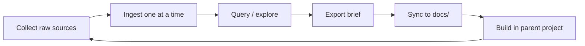

# project-wiki

Per-project research wiki template — a **git submodule** based on [Karpathy's LLM Wiki pattern](https://gist.github.com/karpathy/442a6bf555914893e9891c11519de94f).

Use it to collect research from multiple LLMs (Claude, ChatGPT, Gemini), distill overlapping and conflicting ideas into a compounding wiki, and export synthesis documents that feed your project's brainstorming, planning, and implementation.

**This is not a one-time handoff.** Research runs in parallel with building — collect, distill, and re-export as the project evolves.

---

## What problem this solves

When starting a project you often:

1. Ask the same questions across several LLMs and get duplicated, conflicting, or partial answers
2. Lose useful insights in chat history
3. Struggle to turn scattered research into a clear direction for dev tools (Cursor, VS Code, etc.)

This template gives you a **persistent wiki layer** between raw LLM output and your codebase. The LLM maintains cross-linked pages; you curate sources and steer synthesis.

---

## How it fits your project

Add **project-wiki** as a submodule at `wiki/` inside your project:

```
my-project/
├── docs/
│   ├── PROJECT_BRIEF.md       ← synced from wiki synthesis (repeatable)
│   └── RESEARCH_THESIS.md     ← optional; deeper running synthesis
├── wiki/                      ← project-wiki submodule
│   ├── raw/                   ← starts empty; your project-specific sources
│   │   ├── llm/
│   │   └── web/
│   ├── wiki/                  ← LLM-maintained knowledge base
│   │   ├── sources/
│   │   ├── concepts/
│   │   └── synthesis/
│   ├── AGENTS.md              ← agent schema (portable across tools)
│   └── .cursor/skills/        ← optional Cursor workflow skills
└── src/                       ← your application code
```

Paths below use **submodule root** (`wiki/`). From the parent project, prefix with `wiki/` (e.g. `wiki/raw/llm/`).

> **Yes — `my-project/wiki/` is a git submodule.** It is a separate git repository mounted inside your app. Git tracks it via `.gitmodules` plus a pinned commit SHA in the parent repo. **Do not add `wiki/` to the parent `.gitignore`** — that breaks submodule tracking.

---

## Submodule setup and maintenance

### One wiki repo per project

Each project should have **its own wiki repository** (fork or copy of **project-wiki**), added as a submodule. Do not point every project at the same shared wiki repo — `raw/` and `wiki/` content is project-specific.

```bash
# 1. Create a wiki repo for this project (GitHub/GitLab/etc.)
#    e.g. fork project-wiki → my-saas-wiki

# 2. In your app repo
cd my-project
git submodule add git@github.com:williamjxj/project-wiki.git wiki
git commit -m "add research wiki submodule"
```

This creates two tracked items in the **parent** repo:

| File | Purpose |
|------|---------|
| `.gitmodules` | Submodule name, path (`wiki`), and remote URL |
| `wiki/` (gitlink) | Exact commit SHA of the wiki repo the parent expects |

### Do not gitignore `wiki/`

| Repo | Gitignore `wiki/`? | Why |
|------|-------------------|-----|
| **Parent (app)** | **No** | Submodule must be tracked; gitignore hides it and breaks clones |
| **Wiki (project-wiki)** | N/A | This repo ignores `.obsidian/workspace*.json` only — see `.gitignore` |

What belongs in the **parent** `.gitignore`: `node_modules/`, `.env`, build artifacts — normal app stuff. Not the submodule path.

### Day-to-day maintenance (two commits)

Research changes live in the **wiki submodule** first, then the **parent** records the new submodule commit.

```bash
# Step A — commit inside the submodule
cd wiki
git add raw/ wiki/
git commit -m "ingest: claude auth research"
git push

# Step B — commit in the parent (submodule pointer + synced docs)
cd ..
cp wiki/wiki/synthesis/project-brief.md docs/PROJECT_BRIEF.md
git add docs/PROJECT_BRIEF.md wiki
git commit -m "sync research synthesis"
git push
```

After ingest/export cycles, always check both repos:

```bash
git status              # parent — should show `modified: wiki (new commits)`
cd wiki && git status   # submodule — raw/ and wiki/ changes
```

### Clone and update on another machine

```bash
# Clone parent with submodule
git clone --recurse-submodules git@github.com:you/my-project.git

# Or if already cloned without submodules
git submodule update --init --recursive

# Pull latest wiki content
cd wiki && git pull && cd ..
git submodule update
```

### Optional: rename mount path

Mount as `research/` instead of `wiki/` for cleaner paths (`research/wiki/synthesis/` vs `wiki/wiki/synthesis/`):

```bash
git submodule add git@github.com:you/my-saas-wiki.git research
```

---

## The research loop

Repeat until the project is complete:



| Step | What you do | What the agent does |
|------|-------------|---------------------|
| **Collect** | Paste LLM chats into `raw/llm/`; clip articles into `raw/web/` | — |
| **Ingest** | Review takeaways, confirm | Summarize source, update concepts, revise synthesis |
| **Query** | Ask questions to widen views | Answer from wiki with citations |
| **Export brief** | Review draft, approve | Generate `wiki/synthesis/project-brief.md` |
| **Apply** | Copy synthesis to `docs/`, run `/brainstorming` | — |
| **Build** | Implement with Cursor skills, MCP, etc. | — |

Each export **supersedes** the previous brief. `wiki/synthesis/evolving-thesis.md` stays live between exports.

---

## Quick start

### 1. Add submodule to your project

See [Submodule setup and maintenance](#submodule-setup-and-maintenance) for full details.

```bash
mkdir my-project && cd my-project
git init
git submodule add git@github.com:you/my-project-wiki.git wiki   # fork of project-wiki
git commit -m "add research wiki submodule"
```

Clone an existing project with submodule:

```bash
git clone --recurse-submodules <your-project-url>
```

### 2. Add raw sources

`raw/` starts **empty**. Add project-specific files only.

**LLM chats** — copy-paste into `raw/llm/`:

```
raw/llm/2026-05-24-claude-auth-patterns.md
raw/llm/2026-05-24-chatgpt-auth-patterns.md
raw/llm/2026-05-24-gemini-auth-patterns.md
```

**Web articles** — save with Obsidian Web Clipper (or similar) into `raw/web/`.

Every raw file needs YAML frontmatter:

```yaml
---
type: llm-chat          # or web-article
source: claude          # claude | chatgpt | gemini | web
topic: "auth patterns for SaaS MVP"
date: 2026-05-24
status: pending         # agent sets to ingested after processing
question: "What auth approach for a B2B SaaS MVP?"   # llm-chat only
url: "https://..."                                   # web-article only
---
```

Format reference (copy from, do **not** commit to `raw/`): [`docs/examples/`](docs/examples/)

### 3. Ingest (one source at a time)

Open the **parent project** in Cursor. Say:

```
ingest 2026-05-24-claude-auth-patterns.md
```

Or attach the `wiki-ingest` skill. The agent reads `AGENTS.md`, discusses takeaways with you, then updates `wiki/sources/`, `wiki/concepts/`, `wiki/synthesis/evolving-thesis.md`, `wiki/index.md`, and `wiki/log.md`.

### 4. Query and lint

```
What are the tradeoffs between Clerk and Auth0 for this MVP?
lint the wiki
```

Query widens your view before committing to decisions. Lint catches orphans, contradictions, and pending sources.

### 5. Export brief (repeatable)

```
export brief
```

Produces `wiki/synthesis/project-brief.md` with problem, current understanding, chosen approach, rejected alternatives, and open questions.

Run again after more ingests, mid-implementation, or when revisiting architecture. Prior briefs are marked `superseded`.

### 6. Sync synthesis to your project

From the **parent project root** (submodule mounted at `wiki/`):

```bash
cp wiki/wiki/synthesis/project-brief.md docs/PROJECT_BRIEF.md
cp wiki/wiki/synthesis/evolving-thesis.md docs/RESEARCH_THESIS.md   # optional
git add docs/ wiki
git commit -m "sync research synthesis (cycle N)"
```

> **Path note:** The submodule has an inner `wiki/` directory (Karpathy's knowledge layer). From the parent project that is `wiki/wiki/synthesis/`. If you prefer cleaner paths, mount the submodule as `research/` instead — then use `research/wiki/synthesis/`.

Use `docs/PROJECT_BRIEF.md` in Cursor with `/brainstorming`, skills, and MCP. Drill into the `wiki/` submodule for source attribution and rejected alternatives.

### 7. Keep going

Return to step 2 whenever you have new LLM research, design questions, or course corrections. The wiki compounds — nothing is re-derived from scratch.

---

## Three layers

| Layer | Path | Who owns it | Role |
|-------|------|-------------|------|
| **Raw sources** | `raw/` | You | Immutable chat exports and clips |
| **Wiki** | `wiki/` | LLM agent | Summaries, concepts, cross-links, synthesis |
| **Schema** | `AGENTS.md` | You + agent | Conventions and workflows |

---

## Directory layout (submodule root)

```
.
├── AGENTS.md                 Agent schema — works with Cursor, Claude Code, Codex, etc.
├── README.md                 This file
├── raw/
│   ├── llm/                  LLM chat exports (empty at start)
│   └── web/                  Web article clips (empty at start)
├── wiki/
│   ├── index.md              Page catalog
│   ├── log.md                Append-only operation timeline
│   ├── sources/              One summary per ingested raw file
│   ├── concepts/             Cross-linked topics and decisions
│   └── synthesis/
│       ├── evolving-thesis.md    Running synthesis (always live)
│       └── project-brief.md      Latest export snapshot
├── .cursor/skills/           Cursor workflow accelerators
└── docs/
    ├── examples/             Raw source format examples
    └── superpowers/          Design spec and implementation plan
```

---

## Cursor skills

Optional skills enforce workflow rigidity. `AGENTS.md` remains the portable fallback for any agent.

| Skill | When to use |
|-------|-------------|
| `wiki-ingest` | Process one pending raw source |
| `wiki-query` | Answer from wiki with `[[wikilink]]` citations |
| `wiki-lint` | Health-check contradictions, orphans, index sync |
| `wiki-export-brief` | Generate synthesis snapshot for parent `docs/` |

---

## Tips

- **Ingest one source at a time** — review wiki updates before confirming; batch ingests produce mushy synthesis
- **Keep `raw/` clean** — examples live in `docs/examples/`; only project-specific research goes in `raw/`
- **Use query before export** — export captures what the wiki knows; query helps you discover what you still need
- **Don't freeze early** — `project-brief.md` cycles through `draft → current → superseded`; decisions can evolve
- **Commit submodule + parent together** — wiki changes need two commits: inside `wiki/` first, then update the pointer in the parent
- **Never gitignore `wiki/` in the parent** — use a per-project wiki repo as the submodule remote instead

---

## References

- [Design spec](docs/superpowers/specs/2026-05-24-project-wiki-design.md)
- [Karpathy LLM Wiki gist](https://gist.github.com/karpathy/442a6bf555914893e9891c11519de94f)
- [Raw source format examples](docs/examples/)
