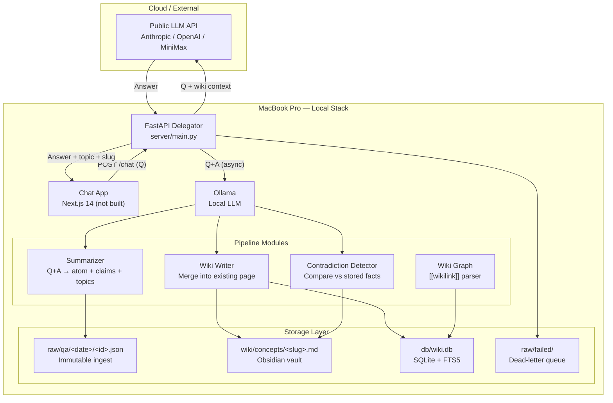
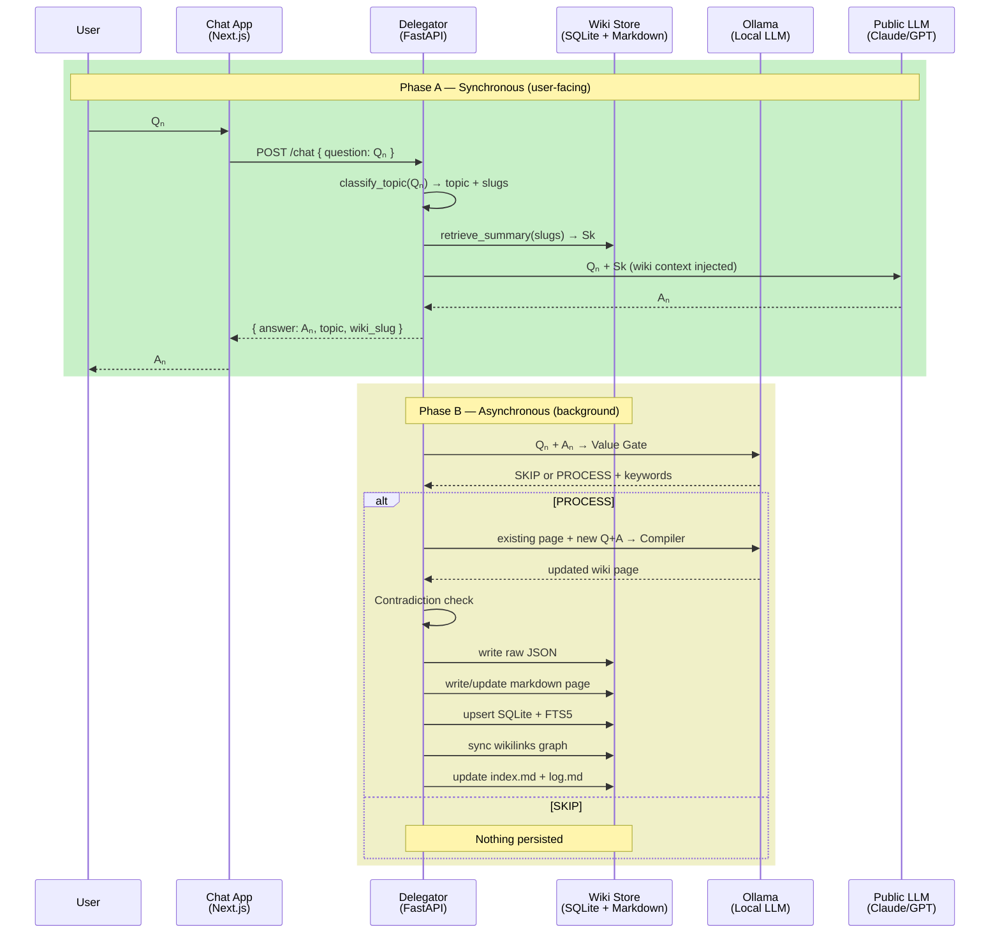
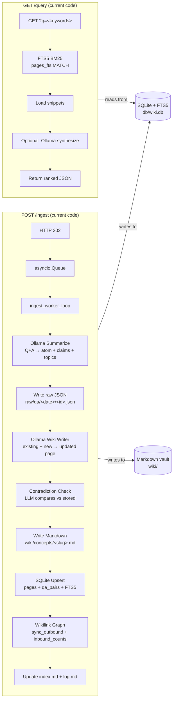

# mem-weaver v2 — Analysis & Roadmap

> **Status:** v1 backend pipeline complete. v2 focuses on closing the feedback loop, wiring in Agent-Skills taxonomy, and adding the frontend.  
> **Based on:** codebase audit + three vision docs (`docs/v2/s2-claude-plan.md`, `docs/2nd-brain-implementation.md`, `docs/architecture-decision-inspiration.md`).

---

## 1. Brief Summary

mem-weaver is a local-first **Dual-LLM memory pipeline** that compiles Q&A conversations into a persistent, searchable knowledge base.

```
 ┌─ External ─────────────────────────────────────┐
 │  Public LLM (Claude/GPT) answers questions     │
 │  with wiki context injected                     │
 └────────────────────────────────────────────────┘
                        ▲
                        │ Q + wiki summary
                        ▼
 ┌─ Local (MacBook) ──────────────────────────────┐
 │  FastAPI Delegator                              │
 │  ├─ Phase A (sync): classify → retrieve wiki   │
 │  │   → inject → public LLM → answer             │
 │  ├─ Phase B (async): Q+A → Ollama → compile    │
 │  │   → write raw JSON → update wiki pages      │
 │  │   → SQLite FTS5 → wikilink graph             │
 │  └─ dead-letter queue for failures              │
 │                                                 │
 │  Ollama (local LLM)                             │
 │  ├─ Summarize: Q+A → atom + claims + topics    │
 │  ├─ Wiki write: existing + new → updated page  │
 │  ├─ Contradiction check: compare vs stored     │
 │  └─ Query synthesis (optional)                  │
 │                                                 │
 │  Storage                                        │
 │  ├─ raw/qa/<date>/ — immutable JSON             │
 │  ├─ wiki/concepts/ — Markdown vault (Obsidian)  │
 │  ├─ db/wiki.db — SQLite + FTS5 + wiki_links    │
 │  └─ raw/failed/ — dead-letter queue             │
 └────────────────────────────────────────────────┘
```

**Core insight:** Instead of sending raw chat history (linear = token bloat + lost-in-the-middle), the local Ollama model distills every Q&A into a dense wiki entry. The public LLM always sees *the essence* of past knowledge, not the noise. The wiki grows incrementally. Memory is never lost; context windows never bloat.

**Status:** The backend pipeline (Phase B) is fully implemented and production-quality. Phase A (the chat endpoint that *uses* the compiled wiki) is the missing link.

---

## 2. Architecture Diagrams

### 2.1 System Overview



### 2.2 Per-Turn Workflow (Phase A + Phase B)



### 2.3 Data Flow — Current Implementation



---

## 3. Current Implementation vs. Vision

### 3.1 What's Built and Working

| Component | Lines / Files | Detail |
|-----------|--------------|--------|
| FastAPI app with 4 routes | `server/main.py` | `/ingest` (202 + async queue), `/query` (FTS5 BM25), `/health`, `/stats` |
| Pydantic v2 models | `server/models/api.py` | `IngestPayload`, `IngestResponse`, `QueryResponse`, `HealthResponse`, `StatsResponse` |
| Runtime config | `server/config/settings.py` | pydantic-settings, `.env` support, typed fields |
| Async ingest worker | `server/pipeline/ingest_worker.py` | `IngestJob` dataclass, `run_ingest_pipeline()`, `ingest_worker_loop()` |
| Ollama client | `server/ollama/client.py` | Async httpx wrapper: `generate_json()`, `generate_text()`, retry logic |
| Summarize prompt | `server/pipeline/prompts.py` | Q+A → JSON: atom + key_claims + detected_topics + detected_entities |
| Wiki page prompt | `server/pipeline/prompts.py` | existing body + atom + claims → updated markdown |
| Contradiction check | `server/pipeline/contradictions.py` | LLM compares new atom vs existing; prepends `> ⚠️` blockquote |
| Wikilink graph | `server/pipeline/wiki_graph.py` | Regex `[[wikilink]]` parser, `sync_outbound_links()`, `recompute_inbound_counts()` |
| Query search (hybrid) | `server/pipeline/query_search.py` | FTS5 BM25 + vector (nomic-embed-text) RRF merge, `?mode=keyword|semantic|hybrid` |
| SQLite schema | `server/db/database.py` + `migrations/001_init.sql` | `pages`, `qa_pairs`, `wiki_links`, `pages_fts`, `qa_fts`, auto-sync triggers |
| Immutable raw JSON store | — Writes to `raw/qa/<date>/<ingest_id>.json` | Written before any processing |
| Markdown wiki vault | — Writes `wiki/concepts/<slug>.md` | Frontmatter + body, Obsidian-compatible |
| Dead-letter queue | — Writes `raw/failed/<ingest_id>.json` | On pipeline exception, full error + job context |
| Wiki index + log | — Updates `wiki/index.md`, appends to `wiki/log.md` | Deterministic maintenance |
| Tests | `tests/test_*.py` | Unit tests (textutil, fts_match_terms, wiki_graph, contradictions) + integration test |
| Smoke check script | `scripts/smoke-check.sh` | Tests all 4 endpoints |
| Embedding pipeline | `server/pipeline/embedder.py` | `embed_text()`, `embed_page()`, `embed_pages_batch()` — nomic-embed-text via Ollama, stored in sqlite-vec |
| Vector search | `server/pipeline/search_semantic.py` | Cosine distance query against `page_embeddings` vec0 table |
| sqlite-vec loader | `server/db/vec.py` | Async extension loader for aiosqlite connections |
| Embedding migration | `server/db/migrations/002_semantic_search.sql` | `page_embeddings` vec0 virtual table (768-d) |
| Embedding backfill | `scripts/backfill_embeddings.py` | One-shot backfill for existing pages |
| Embedding tests | `tests/test_embedder.py`, `test_semantic_search.py`, `test_hybrid_search.py` | 8 tests: dims, distance ordering, RRF merge, empty DB |

### 3.2 What's Not Built (The Gap)

| Feature | Planned In | Status | Impact |
|---------|-----------|--------|--------|
| `POST /chat` endpoint (Phase A) | `second-brain-plan.md` §6.1 | ❌ Not built | **The single biggest gap.** The system compiles knowledge but never feeds it back into a conversation. No real-time context injection. |
| Agent-Skills taxonomy in code | `second-brain-plan.md` §4 | ❌ In docs only | Topic routing relies entirely on Ollama's `detected_topics`. No fast keyword pre-classification. |
| Frontend (Next.js chat app) | `second-brain-plan.md` §7 | ❌ Not built | No UI to interact with. API-only. |
| WikiSidebar / active-context display | `second-brain-plan.md` §7 | ❌ Not built | User can't see which wiki article is being used as context. |
| Semantic search (embeddings) | `s2-plan.md` Phase 4, `second-brain-plan.md` Phase 4 | ✅ Built | nomic-embed-text (768d) via Ollama, sqlite-vec storage, hybrid RRF merge with FTS5. |
| Wiki page hierarchy (sources/entities/synthesis) | `architecture-decision.md` §3.3 | ❌ Flat `concepts/` only | No distinction between "what is X?", "who is Y?", "how do X and Y relate?" |
| Memory lifecycle / decay | `architecture-decision.md` §3.5 | ❌ Not built | All facts live forever at equal weight. No archiving stale content. |
| Cross-vault / domain isolation | `architecture-decision.md` §3.3 | ❌ Not built | Single vault only. No separation by project or topic domain. |
| MCP server (tool exposure) | `architecture-decision.md` §4.3 | ❌ Not built | No way for other agents to call mem-weaver as a tool. |

---

## 4. Current Disadvantages & Limitations

### 4.1 Architectural

- **No feedback loop:** The system is an ingest-only pipeline. It compiles knowledge beautifully but has zero endpoints to use that knowledge conversationally. This undermines the entire "Second Brain" premise.
- **Flat wiki structure:** Every page goes into `wiki/concepts/`. No `entities/`, `sources/`, `synthesis/` folders. As pages grow, distinguishing between concepts, people, and comparative analyses becomes valuable.
- **Single vault, no domain isolation:** All knowledge lives in one namespace. No mechanism to separate "work project" from "personal learning" from "health research."

### 4.2 Search & Retrieval

- **No query-time LLM re-ranking:** The optional `?summarize=true` synthesizes but doesn't re-rank. Results ordering is purely BM25 + RRF score.
- **Multi-article retrieval via RRF:** Hybrid mode (`mode=hybrid`) merges FTS5 and vector search via RRF, returning top-K results from both channels. This effectively handles multi-topic queries.
- **FTS5-only fallback still default for backward compatibility:** The `mode` default is `hybrid` but `keyword` mode preserves the original deterministic BM25 behavior.

### 4.3 Memory & Lifecycle

- **No memory decay:** Every page is equally weighted regardless of last access time or access frequency. `last_accessed_at` and `access_count` don't exist in the schema.
- **No contradiction resolution:** Contradictions are detected and noted as blockquotes, but never resolved. The blockquote accumulates. No mechanism for a human or LLM to reconcile and archive.
- **No tiered memory:** No distinction between working memory (recent sessions), episodic memory (daily summaries), semantic memory (cross-session facts), and procedural memory (workflows).

### 4.4 Operations

- **No dedicated lint endpoint:** `GET /health` and `GET /stats` exist, but there's no `POST /lint` or `GET /lint` that systematically checks for broken wikilinks, orphan pages, stale claims, or contradiction accumulation.
- **No git auto-commit for wiki changes:** Wiki files change but aren't auto-committed. No built-in rollback path beyond manual git operations.
- **Single worker, no concurrency control:** The ingest queue runs one worker. Multiple concurrent ingests are serialized. At a queue size of 100 with ~10s per ingest, that's ~16 minutes of backlog.

### 4.5 Frontend & UX

- **No chat UI:** The system is API-only. No user-friendly way to interact.
- **No visibility into active context:** Even if Phase A existed, there's no UI showing the user which wiki article was injected into their prompt.
- **No manual wiki editing UX:** Correcting or refining wiki pages requires direct file editing in Obsidian or the terminal.

---

## 5. Suggested Features (Priority-Ordered)

### P0 — Must Have for v2

| Feature | Effort | Rationale |
|---------|--------|-----------|
| **`POST /chat` endpoint** | 2-3 days | Closes the feedback loop. The system ceases to be a one-way pipeline and becomes an interactive memory system. |
| **Wire Agent-Skills taxonomy into code** | 1 day | Fast keyword routing replaces pure LLM classification. Deterministic, zero-latency topic matching for 80%+ of queries. |

### P1 — Should Have

| Feature | Effort | Rationale |
|---------|--------|-----------|
| **Next.js chat frontend** | 3-5 days | Provides the UI for Phase A interaction. WikiSidebar shows context. |
| **Embedding + hybrid search** | 3-5 days | ✅ **Done.** `nomic-embed-text` via Ollama, sqlite-vec storage, `search_hybrid()` with RRF merge. `?mode=keyword|semantic|hybrid` on `GET /query`. |
| **Wiki page hierarchy** | 1-2 days | Add `wiki/entities/`, `wiki/sources/`, `wiki/synthesis/`. Route pages by type. |
| **Multi-article retrieval** | 1 day | Top-2/3 slugs concatenated with char cap (e.g., 6000 chars total). |

### P2 — Nice to Have

| Feature | Effort | Rationale |
|---------|--------|-----------|
| **Memory lifecycle (`last_accessed_at`)** | 0.5 day | Add field to `pages` table. Use for ranking boost and archive decisions. |
| **`POST /lint` endpoint** | 1 day | Orphan detection, broken wikilinks, contradiction scan. Append findings to `wiki/log.md`. |
| **Git auto-commit** | 0.5 day | After each wiki write, `git add -A && git commit -m "wiki: update <slug>"`. |
| **Worker concurrency** | 0.5 day | Configurable `WORKER_COUNT` in settings. Multiple `asyncio.create_task` workers. |

### Future (v3+)

- Dedicated chat app with WikiSidebar
- Knowledge graph traversal (Steiner tree, spreading activation)
- Memory decay (Ebbinghaus curve)
- Contradiction auto-resolution via LLM consensus
- MCP server exposing `memory_search`, `memory_add`, `memory_maintain`
- Cross-vault search (domain-specific vaults)
- Fine-tuning dataset export (wiki pages → training data)

---

## 6. Suggested Implementation — `POST /chat`

This is the single most impactful feature. Here's the contract:

### Request

```json
POST /chat
{
  "question": "How do I implement RAG with Ollama?",
  "session_id": "sess_abc123",
  "model": "claude-sonnet-4-20250514"
}
```

### Logic

```
1. classify_topic(question) → topic + candidate_slugs
     - Fast pass: keyword match SKILL_TAXONOMY (0ms)
     - Fallback: Ollama LLM classification (~1s)

2. retrieve_summary(question, candidate_slugs) → (best_slug, summary_text)
     - Score articles by keyword overlap with question
     - Read top match, truncate at 3000 chars

3. construct_priming_context(summary_text)
     - "You have structured background knowledge... Use it as context..."
     - Followed by summary; then "Understood." (priming exchange)

4. call_public_llm(question, priming_context) → answer

5. spawn background task:
     compile_wiki_async(question, answer, topic, best_slug)
       ├─ Ollama Value Gate (SKIP / PROCESS + keywords)
       ├─ If PROCESS: merge into existing wiki page
       ├─ Update index.md + SQLite
       └─ (This is already implemented as run_ingest_pipeline)
```

### Response

```json
{
  "answer": "To implement RAG with Ollama, use nomic-embed-text...",
  "topic": "ml",
  "wiki_slug": "ml/rag-patterns",
  "context_chars": 2890
}
```

### Files to create/modify

| File | Action |
|------|--------|
| `server/pipeline/classifier.py` | Create — `SKILL_TAXONOMY`, `classify_topic()`, `classify_with_ollama()` |
| `server/pipeline/wiki_retriever.py` | Create — `_load_index()`, `retrieve_summary()` |
| `server/pipeline/public_llm.py` | Create — `ask_public_llm()` (Anthropic/OpenAI client with wiki injection) |
| `server/models/api.py` | Modify — add `ChatRequest`, `ChatResponse` |
| `server/main.py` | Modify — add `POST /chat` route |
| `server/pipeline/ingest_worker.py` | Modify — export `run_ingest_pipeline` for background-tasks use |
| `wiki/_index.md` | Create (or adapt from `wiki/index.md`) — machine-readable routing table |
| `.env` | Modify — add `ANTHROPIC_API_KEY`, `OPENAI_API_KEY` |

---

## 7. What's Next

### Immediate (next session)

| Step | Description | Expected Outcome |
|------|-------------|-----------------|
| 1. | Create `server/pipeline/classifier.py` with `SKILL_TAXONOMY` | Keyword-based topic routing (coding/design/ml/business/general) with Ollama fallback |
| 2. | Create `server/pipeline/wiki_retriever.py` | Fast `_index.md` parsing, keyword-overlap scoring, char-capped retrieval |
| 3. | Create `server/pipeline/public_llm.py` | Anthropic + OpenAI clients with wiki context injection |
| 4. | Add `ChatRequest` / `ChatResponse` to `server/models/api.py` | Pydantic models for Phase A |
| 5. | Add `POST /chat` to `server/main.py` | Wire up Phase A: classify → retrieve → inject → answer → background compile |
| 6. | Create `wiki/_index.md` | Machine-readable routing table (Slug, Topic, Keywords, Summary) |
| 7. | Test end-to-end: POST /chat with existing wiki data | Q+A session where wiki context is actually injected |

### Short-term (within a week)

| Step | Description |
|------|-------------|
| 8. | Build Next.js chat app with WikiSidebar |
| 9. | Add `nomic-embed-text` embeddings + hybrid search (FTS5 + cosine RRF) | ✅ Done. `server/pipeline/embedder.py`, `search_semantic.py`, `query_search.py` (RRF). |
| 10. | Add `last_accessed_at` + `access_count` to pages table |

### Medium-term (within two weeks)

| Step | Description |
|------|-------------|
| 11. | Expand wiki structure: `entities/`, `sources/`, `synthesis/` |
| 12. | Add `POST /lint` endpoint |
| 13. | Wire git auto-commit for wiki changes |
| 14. | Add configurable worker concurrency |

The foundation is solid. The backend pipeline (Phase B) is production-quality code. The path to v2 is clear: close the loop with Phase A, wire in the taxonomy, and build the frontend. What's already implemented — the ingest pipeline, contradiction detection, wikilink graph, FTS5 search — is exactly right and doesn't need rework.

---

## 8. Ecosystem Comparison — mem-weaver vs. AI Memory Landscape (2025–2026)

### 8.1 The Four Memory Paradigms

| Paradigm | Examples | Core Idea |
|----------|----------|-----------|
| **Vector RAG** | ChromaDB, Pinecone, LlamaIndex | Embed everything, retrieve by similarity at query time |
| **LLM-Wiki compilation** | Karpathy gist, Spisak second-brain | LLM compiles raw sources into structured wiki at *ingest* time |
| **Graph memory** | Mem0, Zep, Graphiti | Extract entities + relationships, traverse at query time |
| **Tool/MCP memory** | sqlite-memory-server, memory-bank-mcp | Expose memory as tools an agent can call (`read`, `write`, `search`) |

Most commercial systems (Mem0, Zep) are **cloud-only** and **vector/graph hybrids**. The open-source landscape is fragmented — many proof-of-concept repos, few production-grade pipelines.

### 8.2 Where mem-weaver Sits

```
                    Cloud, pay-per-token
                    │
    Mem0 ───────────┤
    Zep  ───────────┤
                    │
                    ├────────────────────── mem-weaver ────► (Dual-LLM, local+cloud)
                    │
  Karpathy gist ────┤
  Spisak repo ──────┤
  SuperLocalMemory ─┤
                    │
                    Local, free
```

### 8.3 Head-to-Head Comparison

| Capability | mem-weaver | Mem0 | Zep | Karpathy gist | Spisak plan |
|------------|-----------|------|-----|---------------|-------------|
| **Dual-LLM split** (Ollama compiles, public LLM reasons) | ✅ Clean architecture | ❌ Single-LLM | ❌ Single-LLM | ❌ Single-LLM | ❌ Single-LLM |
| **Async ingestion pipeline** | ✅ Queue + DLQ + retry | ❌ Sync only | ❌ Sync only | ❌ Manual | ❌ Conceptual |
| **Immutable raw + compiled view** | ✅ Two layers, never lose source | ❌ Flat storage | ❌ Flat storage | ✅ Yes (raw/wiki) | ✅ Yes |
| **Contradiction detection** | ✅ LLM checks before write | ❌ Doesn't exist | ❌ Doesn't exist | ❌ "Lint" only | ❌ Not mentioned |
| **Wikilink graph** | ✅ Extracted and counted | ❌ | ✅ Graph-native | ❌ Implicit | ❌ |
| **Dead-letter queue** | ✅ Pipeline failures captured | ❌ | ❌ | ❌ | ❌ |
| **Local-first** | ✅ Ollama + SQLite | ❌ Cloud | ❌ Cloud | ✅ | ✅ |
| **Self-contained, zero infra** | ✅ pip install + Ollama | ❌ Needs cloud keys | ❌ Needs cloud | ✅ Markdown only | ✅ Markdown only |
| **Phase A (use memory in chat)** | ❌ Missing | ✅ | ✅ | ❌ | ❌ Planned |
| **Semantic search** | ✅ FTS5 + vector RRF | ✅ Vector native | ✅ Vector + graph | ❌ index.md only | ❌ Planned |
| **MCP interface** | ❌ Not built | ❌ | ❌ | ❌ | ❌ |
| **Multi-user** | ❌ Single | ✅ | ✅ | ❌ | ❌ |

### 8.4 What mem-weaver Does That No Other System Does Well

**The Dual-LLM split is genuinely original.** No other system separates compilation (local, async, free) from reasoning (cloud, sync, paid) this cleanly. Mem0 and Zep use one LLM for everything. Karpathy's pattern assumes one LLM. This architecture lets you use a cheap 3B model for the grunt work and a premium model for reasoning — cost-efficient and privacy-smart.

**The pipeline engineering is production-grade.** The async queue, dead-letter queue, retry logic, Pydantic validation, typed settings, database migrations — these aren't POC details. Most OSS memory repos skip all of this. The ingest pipeline would survive in production as-is.

**The contradiction detection is rare and valuable.** Most memory systems silently overwrite. mem-weaver detects conflicts and surfaces them as blockquotes. This is the kind of detail that matters at scale.

### 8.5 The Three Gaps That Block Production Readiness

| Gap | Why It Matters |
|-----|----------------|
| **Phase A doesn't exist** | The system compiles knowledge into a beautiful wiki but has no endpoint to *use* it in a conversation. Without `POST /chat`, mem-weaver is a write-only pipeline. |
| **No semantic search** | FTS5 BM25 works for 500+ pages, but a user searching "attention mechanism" won't find a page about "self-attention" unless the exact phrase is present. Every production memory system has vector search. | ✅ **Resolved.** Hybrid search via nomic-embed-text + sqlite-vec + RRF merge added in Phase 4. Semantic and keyword modes coexist. |
| **No MCP interface** | The Model Context Protocol is becoming the standard way LLMs interact with tools. A memory system without MCP can't be used by Claude Code, Cursor, or any MCP-compatible agent. |

### 8.6 Strategic Recommendation

**Develop it — but as a specialized tool, not a general platform.**

Don't try to out-feature Mem0 or Zep. They have teams, funding, and a head start on vector + graph. Instead, **double down on what makes mem-weaver unique:**

| Priority | Action | Why |
|----------|--------|-----|
| **1** | Build Phase A — `POST /chat` | Turns a pipeline into a product. The single feature that closes the feedback loop. |
| **2** | Add an MCP server | Expose `memory_search` and `memory_add` as MCP tools. Makes mem-weaver usable by Claude Code, Cursor, etc. without building your own frontend. Higher ROI than a chat UI. |
| **3** | Position as "memory for AI coding agents" | Your target user isn't "someone who wants a second brain." It's "a developer who wants their AI coding agent to remember project context across sessions." That's a real, underserved need. |
| **4** | Add semantic search last | ✅ **Done.** Hybrid search (FTS5 + nomic-embed-text + RRF) implemented as Phase 4. FTS5 still works as fallback keyword mode. |

### 8.7 Verdict

**Yes, this solution is good. It deserves production development.**

The Dual-LLM architecture, the async pipeline, the contradiction detection, and the immutable+compiled data model are genuinely better-engineered than 90% of OSS memory projects. The gap is in the user-facing layer (Phase A + MCP), not the core.

The path to a shippable product is clear:
- 3 days of work → Phase A (`POST /chat`)
- 2 days of work → MCP server
- Ship as "context memory for AI coding agents"

No direct competitor is doing the Dual-LLM split well. That's the moat.

---

*Generated from codebase audit: server/*, wiki/*, raw/*, docs/*, tests/*  
*Plan references: docs/v2/s2-claude-plan.md, docs/2nd-brain-implementation.md, docs/architecture-decision-inspiration.md*  
*Ecosystem analysis: Karpathy gist (Apr 2026), Spisak second-brain (Apr 2026), Mem0/Zep docs, SuperLocalMemory V3.3, M2A paper (Feb 2026), Atlan RAG vs Wiki (Apr 2026)*
