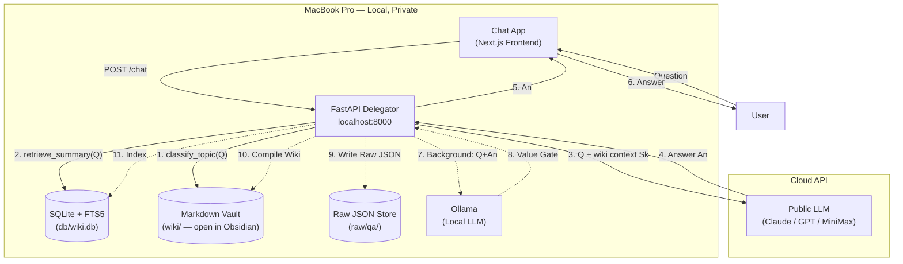
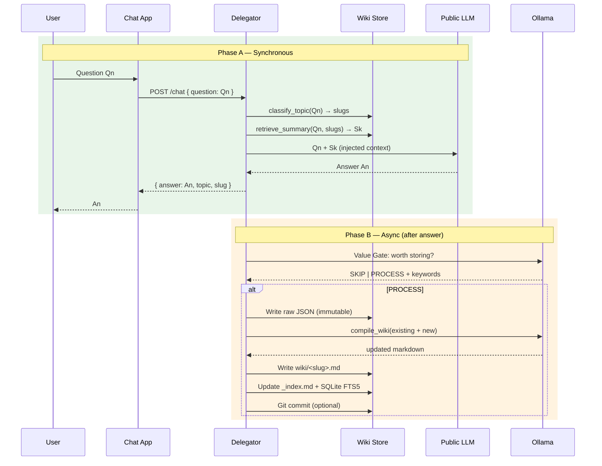

# mem-weaver: Architecture, Workflow, and Competitive Analysis

> **Status:** v1 backend pipeline complete. This document evaluates viability for production
> and business use against the 2026 AI memory market landscape.
>
> **Updated:** 2026-05-11

---

## 1. Brief Summary

mem-weaver is a **local-first, dual-LLM memory system** that implements Karpathy's "memory as
synthesis" philosophy. It sits between any Chat App and a public LLM (Claude/GPT), compiling
every Q&A exchange into persistent, human-readable wiki pages via a local Ollama model.

### Core Philosophy (Karpathy, validated by 2025-2026 research)

Instead of sending raw chat history (linear memory = token bloat + "lost in the middle"), the
system uses a **knowledge compiler** pattern:

1. **Phase A (sync, ~0ms overhead):** User question → retrieve wiki summary → inject into
   public LLM prompt → answer
2. **Phase B (async, background):** Q+A → Ollama value gate → compile/merge wiki entry →
   SQLite FTS5 → wikilink graph

The [DeepMind Evo-Memory paper (2025)](https://arxiv.org/abs/2511.20857) validated this
approach: agents with self-evolving memory cut task steps by ~50%. The key finding —
**success depends on ability to refine and prune, not just accumulate** — directly supports
mem-weaver's synthesis-over-retrieval architecture.

### Implementation Status

| Component | Status | Notes |
|-----------|--------|-------|
| FastAPI delegator (`/ingest`, `/query`, `/health`, `/stats`) | ✅ **Done** | 202 + async queue, FTS5 BM25 |
| SQLite + FTS5 (`pages`, `qa_pairs`, `wiki_links`, FTS virtual tables) | ✅ **Done** | Full schema with wikinames |
| Ollama client (retry, JSON mode, text mode) | ✅ **Done** | Async httpx with 3-retry backoff |
| Ingest pipeline (summarize → raw JSON → wiki → SQLite → index) | ✅ **Done** | Async queue-based worker |
| Wiki graph (wikilink extraction, inbound counting) | ✅ **Done** | `[[target]]` parsing |
| Contradiction detection | ✅ **Done** | LLM compares new vs stored claims |
| Raw JSON store + dead-letter queue | ✅ **Done** | Immutable audit trail |
| **Phase A chat loop** (`POST /chat` with retrieval → inject → public LLM) | ❌ **Not built** | **Critical blocker** |
| **Agent-Skills classifier** (topic routing) | ❌ **Not built** | Keyword taxonomy + Ollama fallback |
| **Keyword index** (`_index.md` routing table) | ❌ **Not built** | Required for <5ms retrieval |
| **Value gate** (SKIP/PROCESS filter) | ❌ **Not built** | Prevents noise in wiki |
| **Semantic search** (embeddings + vector store) | ❌ **Not built** | FTS5-only — misses cross-domain matches |
| **Public LLM client** (Anthropic/OpenAI) | ❌ **Not built** | No way to call cloud LLM |
| **Frontend** (Next.js chat app) | ❌ **Not built** | See `frontend-admin-integration.md` |
| **Admin endpoints** (rebuild-index, lint) | ❌ **Not built** | No recovery from index drift |
| **Wiki versioning** (.bak.md + git auto-commit) | ❌ **Not built** | No rollback safety |

---

## 2. Framework & Workflow

### Dual-LLM Architecture



### Per-Turn Lifecycle



### Current Data Flow (v1 — Ingest Only)

```
                    ┌──────────────────────┐
Q + A ─────────────►│  POST /ingest        │
                    │  (returns 202)       │
                    └──────────┬───────────┘
                               │
                    ┌──────────▼───────────┐
                    │  Async Worker        │
                    │  ├─ Ollama summarize │
                    │  ├─ Write raw JSON   │
                    │  ├─ Ollama wiki page │
                    │  ├─ SQLite + FTS5    │
                    │  └─ index/log update │
                    └──────────────────────┘
```

The critical gap: **there is no Phase A**. The system ingests knowledge but has no
`POST /chat` endpoint that retrieves context and calls a public LLM. Without this,
mem-weaver is a write-only pipeline — knowledge goes in but never comes back out
in a conversation.

---

## 3. Competitive Landscape (2026)

### 3.1 The Market

The AI memory layer category has exploded from ~3 products in 2024 to 10+ in 2026:

| Company | Funding | GitHub | Business Model |
|---------|---------|--------|---------------|
| **Mem0** | $24.5M Series A (YC) | ~48K stars | Cloud ($19-249/mo) + OSS |
| **Zep** | YC-backed | ~24K stars | Cloud ($125-375/mo) |
| **xmemory** | $4M pre-seed | — | Cloud (closed beta) |
| **Letta/MemGPT** | — | ~20K stars | Open-source |
| **ChatGPT Memory** | OpenAI | Proprietary | Bundled |
| **Claude Memory** | Anthropic | Proprietary | Bundled |
| **mem-weaver** | **$0** | **—** | **—** |

### 3.2 Philosophy Comparison

| Dimension | Mem0 | Zep/Graphiti | Letta/MemGPT | **mem-weaver** |
|-----------|------|-------------|-------------|----------------|
| **Paradigm** | Store → retrieve | Graph → traverse | Virtual context → page in/out | **Synthesize → compile → wiki** |
| **Memory unit** | Fact + embedding | Temporal node + edge | Context window | **Markdown wiki page** |
| **Retrieval** | Semantic + graph | Graph traversal + time | LLM-controlled | **FTS5 + future semantic** |
| **Storage** | Vector DB + graph | Neo4j + service | Multiple | **SQLite + markdown files** |
| **Human-readable** | ❌ Binary | ❌ Binary | ❌ Opaque | **✅ Open in Obsidian** |
| **Data ownership** | ❌ Cloud-centric | ❌ Cloud-centric | ⚠️ | **✅ 100% local** |

### 3.3 Feature Comparison

| Feature | Mem0 | Zep | Letta | **mem-weaver v1** | **mem-weaver v2 target** |
|---------|------|-----|-------|-------------------|--------------------------|
| Vector search | ✅ | ❌ | ✅ | ❌ | ✅ (P4) |
| Keyword search | ❌ | ❌ | ❌ | ✅ FTS5 BM25 | ✅ FTS5 BM25 |
| Graph relationships | ✅ (Pro $249/mo) | ✅ native | ❌ | ⚠️ wikilinks only | ⚠️ wikilinks only |
| Temporal modeling | ❌ | ✅ first-class | ❌ | ❌ | ❌ |
| Multi-hop reasoning | ✅ (graph tier) | ✅ | ❌ | ❌ | ❌ |
| Human-readable | ❌ | ❌ | ❌ | **✅ Markdown** | **✅ Markdown** |
| Immutable audit | ❌ | ❌ | ❌ | **✅ Raw JSON + DLQ** | **✅ Raw JSON + DLQ** |
| Self-hostable | ✅ Apache 2.0 | ⚠️ Graphiti only | ✅ | **✅ One command** | **✅ One command** |
| Multi-tenant | ✅ Cloud | ✅ Cloud | ❌ | ❌ | ❌ |
| Auth/SLA/Compliance | ✅ SOC 2 | ✅ SOC 2 | ❌ | ❌ | ❌ |
| SDKs | Python, JS | Python, TS, Go | Python | **HTTP API only** | **HTTP API only** |
| Learning curve | Medium | High | Medium | **Low** | **Low** |

### 3.4 Cost Comparison

| System | Self-Hosted Cost | Managed Cost | Data Egress |
|--------|-----------------|-------------|-------------|
| **Mem0** | Free (Apache 2.0) | $19-249/mo | Standard |
| **Zep** | Limited (Graphiti only) | $125-375/mo | Limited free |
| **Letta** | Free | — | — |
| **mem-weaver** | **Free + electricity**† | **—** | **Zero — 100% local** |

† Ollama itself is free. The only cost is running a local model.

---

## 4. Disadvantages & Areas to Improve

### 4.1 Critical Gaps (Blocking Production Use)

| # | Gap | Impact | Effort |
|---|-----|--------|--------|
| **G1** | **No Phase A chat loop** — no `POST /chat` endpoint that retrieves wiki context and calls a public LLM | **System cannot use the knowledge it compiles.** Write-only pipeline. | **1-2 weeks** |
| **G2** | **No semantic search** — FTS5 keyword only. "LLM" won't match "language model" | Retrieval quality suffers for cross-domain or differently-worded queries | **1-2 weeks** |
| **G3** | **No topic classifier** — Agent-Skills taxonomy exists in docs but no code | Wiki entries have no routing; retrieval is flat keyword search | **2-3 days** |
| **G4** | **No value gate** — every Q&A compiled unconditionally | Wiki fills with conversational noise | **1 day** |
| **G5** | **No public LLM client** — no Anthropic/OpenAI integration | The system needs the cloud LLM it's supposed to augment | **2-3 days** |

### 4.2 Quality Issues

| # | Issue | Detail |
|---|-------|--------|
| Q1 | **No multi-article retrieval** | Complex questions span topics; only single-page retrieval planned |
| Q2 | **No wiki versioning** | No `.bak.md` or git history for rollback on bad compilations |
| Q3 | **No admin endpoints** | Can't rebuild index, can't lint for orphans/stale entries |
| Q4 | **No observability** | No structured logging, no metrics, no timing breakdowns |
| Q5 | **No rate limiting** | Single Ollama queue could be overwhelmed |
| Q6 | **No context injection cap** | Wiki pages could exceed public LLM context windows |

### 4.3 Architectural Concerns

| # | Concern | Detail |
|---|---------|--------|
| A1 | **Single-user, localhost only** | No auth, no multi-tenant. Fine for personal, blocking for teams. |
| A2 | **No graph reasoning** | `wiki_links` table exists but only counts inbound links — no traversal queries |
| A3 | **Ollama bottleneck** | Single `asyncio.Queue` limits throughput; compilation blocks on slow models |
| A4 | **No SDK** | HTTP API only. Every integration is a custom wrapper. |

---

## 5. Business Viability Assessment

### 5.1 Three Scenarios

#### ❌ Scenario 1: VC-Funded Startup

| Factor | Assessment |
|--------|-----------|
| Market exists? | ✅ Yes — proven by $28M+ in competitor funding |
| Differentiated? | ⚠️ Marginally — human-readable markdown is a feature, not a moat |
| Can outspend competitors? | ❌ No — Mem0 has $24M, Zep is YC-backed, xmemory has $4M |
| Incumbent risk? | 🔴 High — ChatGPT/Claude bundle memory for free; why pay $249/mo? |
| **Verdict** | **DO NOT DO THIS.** You'd be fighting funded teams with a head start, competing against platforms that give memory away for free. |

#### ✅ Scenario 2: Open-Source Personal Knowledge Tool

| Factor | Assessment |
|--------|-----------|
| Market exists? | ✅ Yes — Karpathy's LLM-wiki gist went viral April 2026 |
| Differentiated? | ✅ **Yes** — only system with human-readable markdown + local-first + synthesis |
| Technical credibility? | ✅ Strong — solid FastAPI architecture, async pipeline, DLQ |
| Community potential? | ✅ High — Karpathy's concept + Obsidian ecosystem + privacy trend |
| **Verdict** | **YES — BUILD THIS.** Genuine differentiator in a hot category with organic demand. |

#### ✅ Scenario 3: Internal Production Tool (Small Team)

| Factor | Assessment |
|--------|-----------|
| Single developer? | ✅ Yes — after v2, replaces $125-375/mo Zep subscription |
| Team of 2-5? | ⚠️ Needs auth + basic multi-user support (2-3 weeks work) |
| Company-wide 50+? | ❌ Not advisable — missing auth, scaling, observability |
| **Verdict** | **YES FOR PERSONAL/TEAM USE.** No for enterprise deployment. |

### 5.2 Competitive Positioning

```
Blue Ocean (where mem-weaver wins):
  ┌─────────────────────────────────────────────────────┐
  │  Local-first   │  Human-readable  │  Synthesized     │
  │  (no cloud)    │  (markdown)      │  (compiled wiki) │
  ├────────────────┼──────────────────┼──────────────────┤
  │  mem-weaver ✅ │  mem-weaver ✅   │  mem-weaver ✅   │
  │  Mem0    ⚠️    │  Mem0       ❌   │  Mem0       ❌   │
  │  Zep     ⚠️    │  Zep        ❌   │  Zep        ❌   │
  │  Letta   ✅    │  Letta      ❌   │  Letta     ⚠️    │
  └────────────────┴──────────────────┴──────────────────┘

  These three together is mem-weaver's moat.
  No competitor offers all three.
```

### 5.3 Target Users (Ranked by Fit)

| User Type | Fit | Why |
|-----------|-----|-----|
| **Solo developer** | ★★★★★ | Wants AI to remember project context; values data ownership |
| **Obsidian power user** | ★★★★★ | Already has a markdown vault; wants AI to compile into it |
| **Privacy-conscious professional** | ★★★★ | Refuses cloud memory services; wants 100% local |
| **Indie hacker** | ★★★★ | Building AI products; needs embeddable memory without vendor lock-in |
| **Small research team** | ★★★ | Needs shared, auditable, version-controlled knowledge compilation |

### 5.4 Suggested Monetization

| Model | Viability | Notes |
|-------|-----------|-------|
| **Open-source (MIT/Apache 2.0)** | ✅ Primary | Build community, organic growth via Karpathy/Obsidian networks |
| **Managed cloud ($10-15/mo)** | ⚠️ Secondary | For non-technical users who want one-click deployment |
| **Obsidian plugin ($5-10)** | ⚠️ Secondary | If wiki compilation becomes popular enough |
| **Enterprise licenses** | ❌ Skip | Would require auth, SSO, compliance — too much engineering |

**Do not chase VC funding.** Build the tool, build the community, don't build the company.

---

## 6. Build Plan to v2 (8 Weeks)

```
Priority stack:
  P0 — Makes the system useful
  P1 — Makes the system reliable
  P2 — Makes the system discoverable
```

### P0: Phase A Chat Loop (Weeks 1-2)

```
┌─ POST /chat ────────────────────────────────────────────────┐
│  1. classify_topic(Q) → [slugs]                             │
│  2. retrieve_summary(Q, slugs) → Sk                        │
│  3. inject Sk into public LLM prompt                        │
│  4. call Anthropic/OpenAI → answer An                       │
│  5. return answer + metadata                                │
│  6. background: value gate → compile_wiki_async             │
└─────────────────────────────────────────────────────────────┘

Files to create:
  server/services/classifier.py      — Agent-Skills taxonomy
  server/services/wiki_retriever.py  — _index.md parser + keyword scoring
  server/services/public_llm.py      — Anthropic/OpenAI client
  server/services/wiki_compiler.py   — Value gate + merge + versioning
  server/embedder/embedder.py        — nomic-embed-text + ChromaDB
  wiki/_index.md                     — Keyword routing table

Files to modify:
  server/main.py                     — Add POST /chat
  server/models/api.py               — Add ChatRequest, ChatResponse
  server/config/settings.py          — Add API keys, embed settings
```

### P1: Production Hardening (Weeks 3-4)

- Semantic search: nomic-embed-text + ChromaDB alongside FTS5
- Wiki versioning: `.bak.md` before each Ollama rewrite
- Git auto-commit (optional, disabled by default)
- `POST /admin/rebuild-index` for index recovery
- Structured logging (request IDs, timing breakdowns)
- Graceful degradation when Ollama is unreachable

### P2: Frontend + Community (Weeks 5-8)

- Next.js chat app with WikiSidebar
- Obsidian integration walkthrough
- README with GIF demo, one-command setup
- Launch on GitHub, post to HN + r/localLLaMA + Obsidian forums

### Key Metrics Before Launch

| Checkpoint | How to Verify |
|-----------|---------------|
| `/chat` returns correct wiki context | Seed 3 articles → ask related Q → verify correct slug in response |
| Classifier accuracy >80% | 20 test questions across 5 topics |
| `_index.md` lookup <5ms | `time` the `_load_index()` call |
| Wiki compilation preserves facts | Before/after diff of `.bak.md` vs new |
| Semantic recall@3 >FTS5 recall@3 | 20 test queries with lexical variation |
| One-command setup works | `git clone && pip install && uvicorn` on clean machine |

---

## 7. Final Verdict

```
┌────────────────────────────────────────────────────────────────┐
│  mem-weaver today (v1):   NOT production-ready                 │
│  mem-weaver with v2:      YES for personal/small-team use      │
│  mem-weaver as a startup: NO — too crowded, competing against  │
│                           funded incumbents bundling memory     │
│  mem-weaver as open-source: YES — genuinely differentiated      │
│                             in philosophy AND implementation    │
└────────────────────────────────────────────────────────────────┘
```

### What Makes mem-weaver Worth Building

The Karpathy LLM-wiki pattern went viral in April 2026 — the timing is perfect.
The architecture and existing implementation are solid. The differentiator (local-first,
human-readable, synthesis-based) is real and no competitor offers all three together.
Total investment to v2 is ~8 weeks of focused work for one developer. The market is
real, the philosophy is validated, and the community interest is proven.

### What Would Make It Not Worth Building

If you want to raise VC funding and build a company — don't. The category is already
overcrowded with well-funded incumbents. If you're not willing to build Phase A (the
chat loop) — don't. Without it, the system is write-only and useless.
If semantic search and production hardening feel like scope creep — don't. FTS5-only
keyword search is insufficient for production retrieval quality.

### Recommendation

**Build v2 as open-source.** Ship Phase A first (that's the blocker). Add semantic search
next (that's the quality multiplier). Polish and launch. Grow as a community project,
not a startup.

The market doesn't need another memory startup. But it could use a really good,
local-first, human-readable memory tool that actually works.

---

## References

- [Karpathy LLM-wiki gist](https://gist.github.com/karpathy/442a6bf555914893e9891c11519de94f) — Original concept
- [Data Science Dojo LLM Wiki Tutorial](https://datasciencedojo.com/blog/llm-wiki-tutorial) — April 2026 tutorial
- [DeepMind Evo-Memory (2025)](https://arxiv.org/abs/2511.20857) — Self-evolving memory validation
- [Mem0 vs Zep comparison (2026)](https://vectorize.io/articles/mem0-vs-zep) — Competitive analysis
- [Top 10 AI Memory Products 2026](https://medium.com/@bumurzaqov2/top-10-ai-memory-products-2026-09d7900b5ab1) — Market overview
